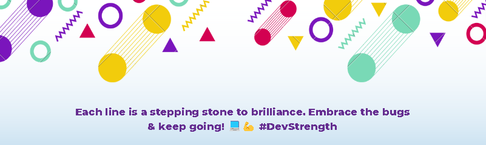

<h1 align="center">Hello! I'm Tshepiso</h1>

  
  

  

## 👨🏻‍💻 About Me:  

- 🚀 Currently immersed in an `exciting project`.

- 🌱 Learning the intricacies of `Machine Learning and Artificial Intelligence (AI)`.

- 🤝 Open to collaborative opportunities in the realm of `development projects`.

- 🧠 Seeking guidance in the realm of `Blockchain Development`.

- 💬 Let's engage!

- 🎸 Life Philosophy: Dive into new technologies, absorb the knowledge 🔥, and spread the wisdom 🎉.

- ⚡ Fun fact: My creative side flourishes in music production, and I spend my downtime crafting melodic masterpieces.

## 🛠️ Technologies and Tools I use:

 

 
 
 

## ❤️ Let's Get Connected:

 

